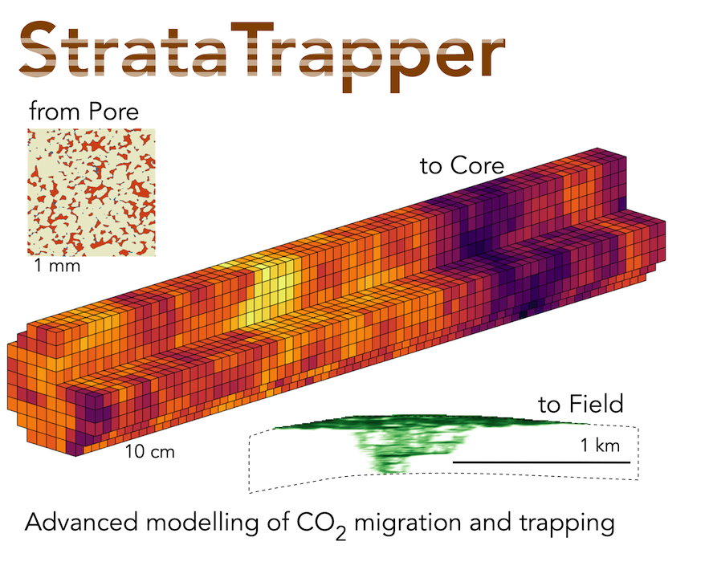
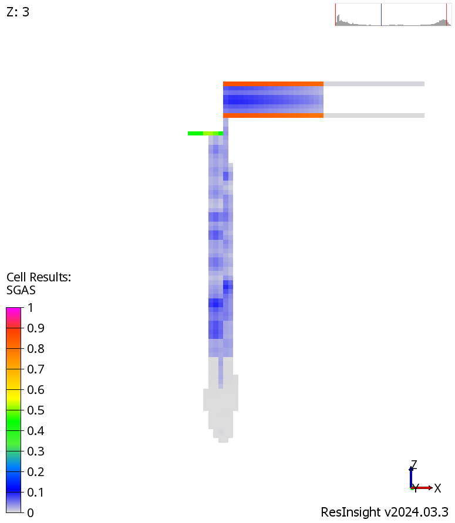
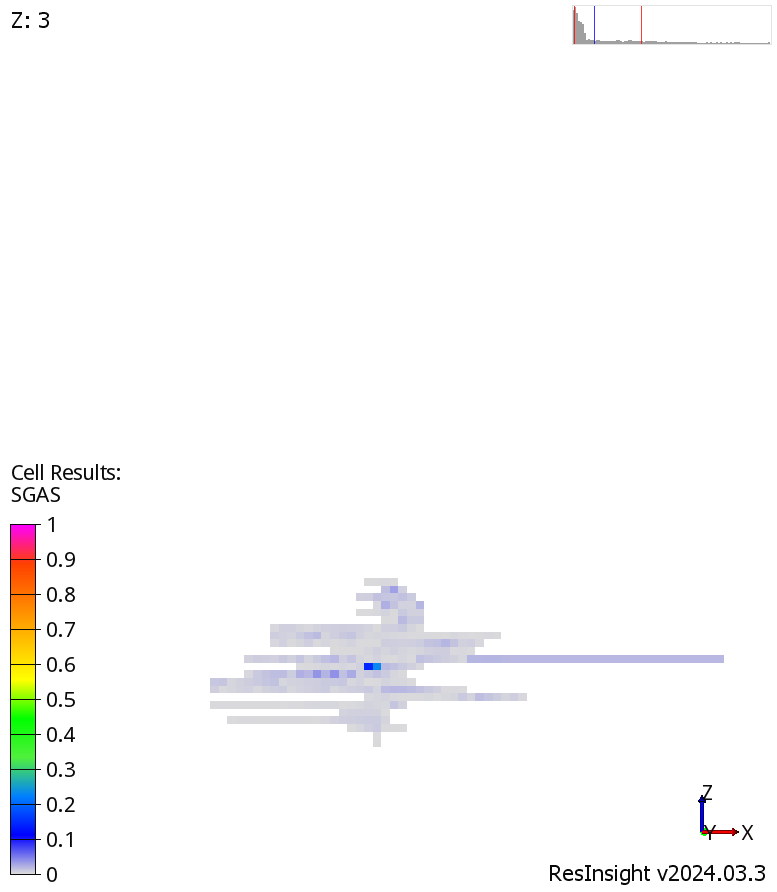

# Models upscaled with [StrataTrapper](https://github.com/ImperialCollegeLondon/StrataTrapper)

[](https://creativecommons.org/licenses/by/4.0/)

Repository:
[github.com/ImperialCollegeLondon/StrataTrapper-models](https://github.com/ImperialCollegeLondon/StrataTrapper-models)

- [Contents](#contents)
- [Endurance models](#endurance-models)
- [East Mey models](#east-mey-models)
- [PFLOTRAN-OGS reservoir simulations](#pflotran-ogs-reservoir-simulations)
- [Docker image](#docker-image)
- [References](#references)



## Contents

- [`endurance/`](endurance/)
    Folder with Endurance CCS site sector models in [PFLOTRAN-OGS](https://docs.opengosim.com/) input format
- [`east-mey/`](east-mey/)
    East Mey CCS site models
- [`Dockerfile`](Dockerfile)
    Docker image with clean installation of PFLOTRAN-OGS-1.8

## Endurance models

Endurance CCS site sector model in PFLOTRAN-OGS's [input deck](https://docs.opengosim.com/manual/input_deck/input_deck/) format.
In [`endurance/`](endurance/) directory:

1. [`one-well-base.in`](endurance/one-well-base.in)
2. [`one-well-upsc.in`](endurance/one-well-upsc.in)
3. [`four-wells-base.in`](endurance/four-wells-base.in)
4. [`four-wells-upsc.in`](endurance/four-wells-upsc.in)

`one-`/`four-` stands for the number of injection wells in the model.
`-base` stands for reference viscous-limit upscaling with zero capillary pressure.
`-upsc` stands for capillary-limit upscaling conducted by [StrataTrapper](https://github.com/ImperialCollegeLondon/StrataTrapper) toolkit.

In detail, specifications can be found in preprint [2].

## East Mey models

The East Mey models in this repository are based on a model developed by the **ACT consortium** (Accelerating CCS Technologies).
Our work is based on that model, as opposed to later versions of the East Mey model that might exist outside of the public domain.

East Mey CCS site model in PFLOTRAN-OGS's [input deck](https://docs.opengosim.com/manual/input_deck/input_deck/) format.
In [`east-mey/`](east-mey/) directory:

1. [`1-base.in`](east-mey/1-base.in)
2. [`1-base-pc.in`](east-mey/1-base-pc.in)
3. [`1-upsc.in`](east-mey/1-upsc.in)
4. [`2-base.in`](east-mey/2-base.in)
5. [`2-base-pc.in`](east-mey/2-base-pc.in)
6. [`2-upsc.in`](east-mey/2-upsc.in)

- `1-`/`2-` stands for two particular well placements and respective injection scenarios.
- `-base` stands for base coarse dynamic model (directly based on ACT's developments).
- `-base-pc` stands for the `-base` model with added capillary pressure model.
- `-upsc` stands for capillary-limit upscaling conducted by [StrataTrapper](https://github.com/ImperialCollegeLondon/StrataTrapper) toolkit.

## PFLOTRAN-OGS reservoir simulations

To run the supplied models, PFLOTRAN-OGS-1.8 installed on Ubuntu 22.04 is required. A dedicated Docker image can be used instead, which is covered in the [next section](#docker-image).

For a model folder `<model_folder>` containing `.in` files:

0. Unarchive large files with characteristic curves `chc[xyz].data`
from `chc[xyz].zip` located at `<model_folder>/include/`.
1. Go to a model directory. Using the command line from repository root:

    ```shell
    cd <model_folder>
    ```

2. Start a simulation using the `run.sh` shell script

    ```shell
    bash ./run.sh <model_name> [number_of_processes]
    ```

    - `<model_name>` is an input file name with `.in` omitted
    - `[number_of_processes]` is optional. It is responsible for MPI-based parallelization and equals `4` by default.

    Examples:

    ```shell
    cd endurance
    # runs with 8 parallel processes
    bash ./run.sh one-well-base 8
    # runs with 4 parallel processes
    bash ./run.sh four-wells-upsc
    ```

    Currently, memory demand per process is significantly higher for upscaled models.
    Thus, it's preferable to use fewer processes for `-upsc` models, expecting slightly higher computation times.

3. Visualize simulation results using [ResInsight](https://resinsight.org/) or equivalents.

    | Viscous-limit upscaling        | Upscaled with StrataTrapper    |
    |--------------------------------|--------------------------------|
    |  |  |

## Docker image

[](https://opensource.org/licenses/BSD-3-Clause)

To avoid manual installation of PFLOTRAN-OGS, we provide a [Docker](https://www.docker.com/) image described by the [`Dockerfile`](Dockerfile).
Once Docker is installed and Docker engine is running:

1. Build the image using command from [`docker-build.txt`](docker-build.txt)

    ```shell
    docker build --progress=plain --platform linux/amd64 -t pflotran-ogs .
    ```

2. Run a container from the built image using command from [`docker-run.txt`](docker-run.txt)

    ```shell
    docker run -it pflotran-ogs
    ```

## References

1. [StrataTrapper: upscaling toolkit](https://github.com/ImperialCollegeLondon/StrataTrapper)
2. [The Impact of Capillary Heterogeneity on CO2 plume migration at the Endurance CO2 storage Site in the UK](https://doi.org/10.22541/essoar.172124876.67014161/v1)
3. [Small-Scale Capillary Heterogeneity Linked to Rapid Plume Migration During CO2 Storage](https://doi.org/10.1029/2020GL088616)
4. [Endurance models in ECLIPSE format](https://doi.org/10.5285/7b616c86-e426-436d-87cd-1a3a8cc3c06d)
